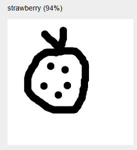

# P5 Doodle Classifier Workshop

In this workshop, participants write code to classify doodles that they draw on screen.

Uses the ml5.js library (https://ml5js.org/).

## Doodle Creator
Program to create multiple drawings quickly and save them to a file.
Use the files to train a model.
Then pass model to Teachable Machine (https://teachablemachine.withgoogle.com/train/image)

Then use DoodleClassifier to classify

## Doodle Classifier

Set the model from teachable machine (created from images in Doodle Creator) in the code.

The program will then classify drawn images according to the model.

## Doodle Classifier Demo
Uses the generic model to classify a range of images drawn on the screen.

